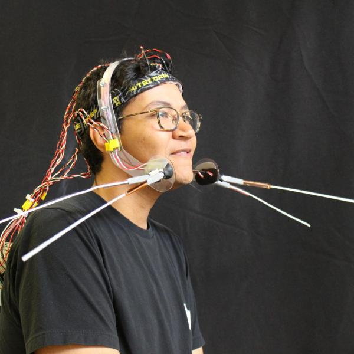
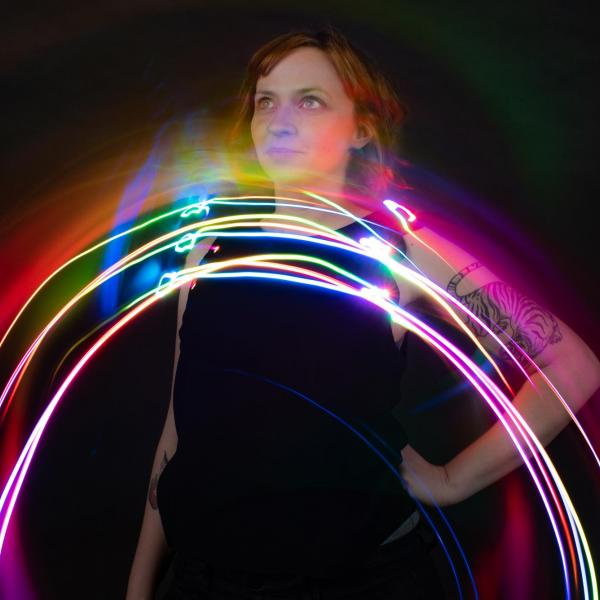

# *Cyborg Crafts: Vibrotactile Tongue Vision (VTTV)

*[Cyborg Crafts](https://www.colorado.edu/atlas/cyborg-crafts-vibrotactile-tongue-vision) is a collaboration among five researchers at the University of Colorado, Boulder.

### Cyborg Crafts: Vibrotactile Tongue Vision (VTTV) is a seven-segment vibrotactile tongue display that enables users to augment auditory and visual experiences through haptics.

This project was submitted, and accepted to, the [IEEE World Haptics Conference 2021 Student Innovation Challenge](https://2021.worldhaptics.org/sic/). Very big thank you to the organizers for supplying the hardware!

## Authors

### Team

<!-- For each team member, duplicate this following subsection and update Name, biography, pronouns and website. Please store pictures under images/portraits/ and use only Name in CamelCase for filenames. -->

#### Sandra Bae

Sandra Bae is a data visualization researcher gone rogue. She dream of a future with as much of Materials Science as Computer Science. Her current research interest focuses on pushing data beyond the flat screen by exploring how materials can communicate and represent data. She likes to work on projects as a developer and designer with a focus on information visualization and has worked with NASA-JPL, the John Muir Institute, and the Exploratorium Museum. She is interested in how interactive visualizations can help break down complex topics and promote creativity, storytelling, and insight. Broadly speaking, she is interested in projects that promote the interplay of human, machine, and data. Sandra is co-advised by Danielle Szafir and Ellen Do, and she is a member of both the VisuaLab and ACME Lab. She holds a BA in human-computer interactions and an MS in computer science, both from the University of California, Davis.

Find more information on her [website](https://sandrabae.github.io).

#### Chris Hill

Chris Hill is a Ph.D. student in Creative Technology and Design advised by Ann Eisenberg and Daniel Leithinger. He is a McNair Scholar, a Google CS Research Mentorship participant, and he received honorable mention in the 2020 Computing Research Association Outstanding Undergraduate Researcher awards. His research interests lie in human augmentation, sensory extension, transhumanism, biohacking, and educational technology. These interests have led to the development of open-source sensory extension and augmentation devices that he hopes will be replicated, accelerating scientific discovery and building stronger development communities in the field.

Find more information on his <!-- update pronouns--> [website](https://chrisnhill.com/).

#### Casey Hunt

Casey Hunt is an ACS Certified Biochemist with a Bachelor’s degree from the University of Utah. After several years of work in environmental and personnel monitoring for the immuno-oncology startup NextCure, Casey became fascinated by the myriad of sensors in the lab designed to track personnel (and microbe) activity—as well as the psychosocial factors at play in this ubiquitous sensing environment. For the last two years, she has designed novel sensing techniques for ubiquitous computing applications as a Master’s student in Creative Technology and Design and a member of the THING Lab at the CU ATLAS Institute. Casey is especially motivated by the need for haptic systems to facilitate remote collaboration and connection.

Find more information on her <!-- update pronouns--> [website](https://caseyhunt.github.io/).

#### Netta Ofer

Netta Ofer is a Research Master's student in the Living Matter Lab at the ATLAS Institute. Her background is in media studies, human-computer interaction (HCI), and interaction design from the Media Innovation Lab (milab) at IDC Herzliya. Netta's work has focused on how coding can create creative and personally-meaningful opportunities for children, specifically by bridging the digital and physical worlds. Today, her design research aims to discuss the relationship between the designed and natural world, and the human body from a speculative and critical lens.

<!-- Find more information on their [website](https://). -->

#### Mary West

Mary Etta West completed her Bachelor of Science in Electrical Engineering from the University of Nevada Las Vegas in 2015. She went on to spend five years in the industry inventing and designing products and tools for SparkFun Electronics and Boulder Engineering Studio. She is currently in her second year as a Ph.D. student in Computer Science at the University of Colorado Boulder focusing on wearables, human-computer interaction and integration, physical computing, robotics, and data physicalization. She is advised by Danielle Szafir, Ben Shapiro, and Joel Swanson.

Find more information on her <!-- update pronouns--> [website](https://).

### Advisor

<!-- Uncomment this section title and add a #### Name subsection if your team appointed an advisor. -->
#### Daniel Leithinger

Daniel Leithinger, assistant professor (ATLAS Institute & Computer Science) creates shape-changing human-computer interfaces that push digital information past the boundaries of flat displays, and into the real world. Motivated by the belief that computers must embrace the dexterity and expressiveness of the human body, his interfaces allow users to touch, grasp and deform data physically. Daniel received his Ph.D. at the MIT Media Lab in 2015. His academic publications have been published at ACM UIST, TEI, and CHI conferences, and he has received design awards from Fast Company, Red Dot, and IDEA. Projects like "inFORM" have been exhibited at the Cooper Hewitt Design Museum, Ars Electronica Museum, and the Milan Design Week.

Find more information on his <!-- update pronouns--> [website](http://leithinger.com/).

### Chairs

#### Christian Frisson

Christian Frisson is an associate researcher at the Input Devices and Music Interaction Laboratory (IDMIL) (2021), previously postdoctoral researcher at McGill University with the IDMIL (2019-2020), at the University of Calgary with the Interactions Lab (2017-2018) and at Inria in France with the Mjolnir team (2016-2017). He obtained his PhD at the University of Mons, numediart Institute, in Belgium (2015); his MSc in “Art, Science, Technology” from Institut National Polytechnique de Grenoble with the Association for the Creation and Research on Expression Tools (ACROE), in France (2006); his Masters in Electrical (Metrology) and Mechanical (Acoustics) Engineering from ENSIM in Le Mans, France (2005).
Christian Frisson is a researcher in Human-Computer Interaction, with expertise in Information Visualization, Multimedia Information Retrieval, and Tangible/Haptic Interaction. Christian creates and evaluates user interfaces for manipulating multimedia data. Christian favors obtaining replicable, reusable and sustainable results through open-source software, open hardware and open datasets.
With his co-authors, Christian obtained the IEEE VIS 2019 Infovis Best Paper award and was selected among 4 finalists for IEEE Haptics Symposium 2020 Most Promising WIP.

Find more information on his [website](https://frisson.re).

#### Jun Nishida

Jun Nishida is **Currently** Postdoctoral Fellow at University of Chicago & Research Fellow at Japan Society for the Promotion of Science (JSPS PDRA) / **Previously** JSPS Research Fellow (DC1), Project Researcher at Japanese Ministry of Internal Affairs and Communications, SCOPE Innovation Program & PhD Fellow at Microsoft Research Asia / Graduated from Empowerment Informatics Program, University of Tsukuba, Japan.

I’m a postdoctoral fellow at University of Chicago. I have received my PhD in Human Informatics at University of Tsukuba, Japan in 2019. I am interested in designing experiences in which all people can maximize and share their physical and cognitive capabilities to support each other. I explore the possibility of this interaction in the field of rehabilitation, education, and design. To this end, I design wearable cybernic interfaces which share one’s embodied and social perspectives among people by means of electrical muscle stimulation, exoskeletons, virtual/augmented reality systems. Received more than 40 awards including Microsoft Research Asia Fellowship Award, national grants, and three University Presidential Awards. Review service at ACM SIGCHI, SIGGRAPH, UIST, TEI, IEEE VR, HRI.

Find more information on their [website](https://junis.sakura.ne.jp/wp).

#### Heather Culbertson

Heather Culbertson is a Gabilan Assistant Professor of Computer Science at the University of Southern California. Her research focuses on the design and control of haptic devices and rendering systems, human-robot interaction, and virtual reality. Particularly she is interested in creating haptic interactions that are natural and realistically mimic the touch sensations experienced during interactions with the physical world. Previously, she was a research scientist in the Department of Mechanical Engineering at Stanford University where she worked in the Collaborative Haptics and Robotics in Medicine (CHARM) Lab. She received her PhD in the Department of Mechanical Engineering and Applied Mechanics (MEAM) at the University of Pennsylvania in 2015 working in the Haptics Group, part of the General Robotics, Automation, Sensing and Perception (GRASP) Laboratory. She completed a Masters in MEAM at the University of Pennsylvania in 2013, and earned a BS degree in mechanical engineering at the University of Nevada, Reno in 2010. She is currently serving as the Vice-Chair for Information Dissemination for the IEEE Technical Committee on Haptics. Her awards include a citation for meritorious service as a reviewer for the IEEE Transactions on Haptics, Best Paper at UIST 2017, and the Best Hands-On Demonstration Award at IEEE World Haptics 2013.

Find more information on her [website](https://sites.usc.edu/culbertson/).

## Contents

- [Abstract](#abstract)
- [Introduction](#introduction)
- [Motivation](#motivation)
  * [Documentation](#documentation)
    + [Introduction](#introduction-1)
    + [What Do We Mean by “Craft Tactile Experiences”?](#sens)
    + [Contributing](#contributing)
    + [Other Documentation Platforms](#docs)
    + [Materials](#materials)
      - [Hardware](#hardware)
      - [Software](#software)
      - [Syntacts](#syntacts)
      - [Other Materals](#mats)
    + [Hardware Wiring Diagram](#wire)
    + [Step 1: Hardware Steup](#S1)
    + [Step 2: Wire and Connect the Seven Pressure Sensors](#S2)
    + [Step 3: Build your Tongue Display Unit (TDU)](#S3)
      - [Step 4: Prepare Vibration Motors](#S4)
      - [Step 5: Vacuum & Seal the TDU](#S5)
      - [Step 6: Connect Vibration Motors to Syntacts Board](#S6)
    + [Step 7: Connect Syntacts](#S7)
    + [Step 8: Raspberry Pi Set Up and Software](#S8)
    + [Step 9: Make Your Controller Housing](#S9)
    + [Step 10: Embedding the TDU in Candy](#S10)
    + [Step 11: How to connect the GUI](#S11)
    + [Step 12: Done!](#S12)
- [Acknowledgements](#acknowledgements)
- [License](#license)

<!-- tocstop -->

## Abstract

<!-- Summarize your project: for now copy the short pitch from your proposal -->

Cyborg Crafts: Vibrotactile Tongue Vision (VTTV) is a seven-segment vibrotactile tongue display that enables users to augment auditory and visual experiences through haptics.

## Introduction

<!-- Explain your project: for now copy the 300-word description from your proposal -->

The Vibrotactile Tongue Vision (VTTV) system is an open-source programmable tongue display unit (TDU) that augments visual and auditory experiences through haptic feedback. VTTV is designed to be low floor and wide walls, enabling those without embedded systems skills to fabricate a TDU, controller, and craft tactile experiences easily. Experienced engineers, researchers, makers, and artists can hack VTTV to be an actuator in their projects.

TDUs typically use electrotactile stimulation to display information to the user. These systems produce sensations by generating voltage pulses from electrodes to the user’s tongue. These commercial TDU systems are closed source, prohibitively expensive, and compromise haptic resolution for user comfort. Cyborg Crafts proposes an alternative to electrotactile TDUs, a novel system that uses ERM motors for actuation. Cyborg Craft’s goal is to enable anyone to fabricate their own TDU using easily accessible materials with affordable tools. 

## Motivation
VTTV is motivated by our interest in enabling users to craft tactile sensory experiences. Crafting tactile experiences has the potential to engage a wide range of users through an accessible interface and hackable TDU actuator. The tongue is an extremely sensitive and uniquely discrete area for open-source haptic output that has not been fully explored [3].

### Documentation

# *Cyborg Crafts: Vibrotactile Tongue Vision (VTTV) - Design a Seven-Segment Vibrotactile Tongue Display to Augment Auditory and Visual Experiences

*[Cyborg Crafts](https://github.com/ADataDate/Cyborg-Crafts-VTTV/blob/main/images/ccplaybutton.png) is a collaboration among five researchers at the University of Colorado, Boulder.

## Introduction

This project was submitted, and accepted to, the [IEEE World Haptics Conference 2021 Student Innovation Challenge](https://2021.worldhaptics.org/sic/). Very big thank you to the organizers for supplying the hardware!

Video voice-over was done by [Vincent Haney](https://www.tiktok.com/@johnmayerlover3000?).

The Vibrotactile Tongue Vision (VTTV) system is an open-source programmable tongue display unit (TDU) that augments visual and auditory experiences through haptic feedback. VTTV is designed to be low floor and wide walls, enabling those without embedded systems skills to fabricate a TDU, controller, and craft tactile experiences easily. Experienced engineers, researchers, makers, and artists can hack VTTV to be an actuator in their projects. Cyborg Crafts will design, fabricate, and implement a TDU that will extend the user’s perception through a vibrotactile display. The project will also produce a controller to program haptic patterns directly to the VTTV system.

TDUs typically use electrotactile stimulation to display information to the user. These systems produce sensations by generating voltage pulses from electrodes to the user’s tongue. Commercial TDU systems are closed source, prohibitively expensive, and compromise haptic resolution for user comfort. Cyborg Crafts proposes an alternative to electrotactile TDUs, a novel system that uses ERM motors for actuation. Cyborg Craft’s goal is to enable anyone to fabricate their own TDU using easily accessible materials with affordable off-the-shelf tools. The merit of this project is a replicable design with instructions on free-to-use online platforms such as Instructables. This will enable makers, students, artists, hackers, and researchers to fabricate and implement a TDU as an output device.

## What Do We Mean by “Craft Tactile Experiences”?

Crafting is the act of skillfully creating an object or an experience such as a story or narrative. There is a tradition of sharing crafted sensory experiences, from the sharing of a mixtape/playlist; to sharing photos from a vacation. These experiences are often passive and static; one cannot feel the explosions of fireworks in a photo or feel the crashing of tidal waves in a video. Vibrotactile Tongue Vision prioritizes the crafting of tactile actuation that can be connected to other sensory experiences. Similar to associating scents with specific experiences, one can create a tactile experience that will be associated with static experiences.

Through the creation and dissemination of VTTV, we will introduce a new genre of human augmentation: **sensory crafting**. Sensory crafting is the crafting of a sensory experience to be shared from one human's sensory modality (e.g., visual, auditory) to another through a mediating device. Unlike previous devices where the user reacts to transduced signals from sensors, VTTV encourages users to reflect on their own sensory experiences and then program actuation to be shared. In addition to a sensory crafting device, VTTV is also an open-source, hackable tongue display unit that can be utilized as a haptic output for various research and maker applications.

## Contributing
Pull requests are welcome. For major changes, please open an issue first
to discuss what you would like to change.

Please make sure to update as appropriate!

## Other Documentation Platforms
Support this project on the following documentation platforms:

[Instructables](https://www.instructables.com/Cyborg-Crafts-Vibrotactile-Tongue-Vision-VTTV-Desi/)

[Make:Projects](https://makeprojects.com/project/cyborg-crafts-vibrotactile-tongue-vision-vttv---seven-segment-vibrotactile-tongue-display)

[Hackster](https://www.hackster.io/CyborgCrafts/cyborg-crafts-vibrotactile-tongue-vision-a98190)

---------------

## Materials

**Hardware**:

1 x [Raspberry Pi 4](https://www.raspberrypi.org/products/raspberry-pi-4-model-b/) * $35

1 x [16 GB SD Card](https://www.amazon.com/PNY-microSDHC-Memory-2-Pack-P-SDU16GX2U185GW-GE/dp/B07TDN2G18/ref=sr_1_1?dchild=1&keywords=16gb+micro+sd+card&qid=1624680378&sr=8-1) * $7

1 x [Octo Raspberry Pi Sound Card](https://www.amazon.com/Octo-channel-sound-card-Raspberry/dp/B06Y3PZ6MF/ref=sr_1_4?dchild=1&keywords=Audio+Injector+Sound+Card+for+The+Raspberry+Pi+with+inbuilt+Microphone&qid=1624680521&s=electronics&sr=1-4) * $58

1 x [Syntacts Amplifier (TI-TPA211A1-Q1) - V3.1](https://www.syntacts.org/hardware/) * $?

4 x [RCA to 3mm Cable](https://www.amazon.com/oldboytech-Nylon-Braided-Auxiliary-Smartphone-Echo-Dot/dp/B07HDYLFS2/ref=sr_1_4?dchild=1&keywords=3mm+to+rca+cable&qid=1624680665&sr=8-4) * $10

2 x [SparkFun QWIIC 12 Bit ADC - 4 Channel](https://www.sparkfun.com/products/15334) (ADS1015) * $10.50

7 x [Force Sensitive Resistor 0.5”](https://www.sparkfun.com/products/9375) * $7

7 x [8mm LRA Vibrotactile actuators](https://www.digikey.com/en/products/detail/jinlong-machinery-electronics-inc/G0825001D/10285885) * $3.17

3 x [QWIIC Cable - 200mm](https://www.sparkfun.com/products/14428) * $1.50

[30 AWG black silicone stranded-core wire](https://www.adafruit.com/product/2051) * $10

Total = $246.69 + Syntacts amplifier

**Software**:

If you are pulling the [Cyborg Crafts repository](https://github.com/ADataDate/Cyborg-Crafts-VTTV/wiki) or imaging an SD card with the image file we provided you are all set to start sensory crafting!

Python 3/Pycharm

**Syntacts**

Octo Audio Injector Sound Card

ADS1015 Python package

**Other Materials:**
[Heat shrink](https://www.amazon.com/Ginsco-580-pcs-Assorted-Sleeving/dp/B01MFA3OFA/ref=sr_1_4?dchild=1&keywords=heat+shrink&qid=1624685739&sr=8-4) * $7

[Soldering Iron](https://www.adafruit.com/product/3685) * $20

[Food vacuum sealer](https://www.amazon.com/GERYON-Vacuum-Automatic-Machine-Starter/dp/B08DTS69FQ/ref=sr_1_6?dchild=1&keywords=vacuum+sealer&qid=1624681110&sr=8-6) * $20

[Vacuum sealer bags](https://www.amazon.com/Wevac-Weston-Commercial-Puncture-Prevention/dp/B07TV5RNQL/ref=sr_1_8?crid=1ORKZCBVYQ1W3&dchild=1&keywords=vacuum+sealer+bags&qid=1624681155&sprefix=vacuum+sealer%2Caps%2C232&sr=8-8) * $16

[Hand-held bag sealer](https://www.amazon.com/KARIDGE-Handheld-Airtight-Portable-Pressure/dp/B07SMFQJGW/ref=sr_1_10?dchild=1&keywords=handheld+bag+sealer&qid=1624681377&sr=8-10) * $9

Hollow drinking/lolipop straws (plenty of options available) * $6

[Baking chocolate](https://www.amazon.com/NESTLE-HOUSE-Semi-Sweet-Chocolate-Morsels/dp/B00932F6Y6/ref=sr_1_5_0g_fs?dchild=1&keywords=chocolate+chips&qid=1624681674&s=grocery&sr=1-5) or [Gummies](https://www.amazon.com/Haribo-Gummi-Candy-Goldbears-Pound/dp/B000EVOSE4/ref=sr_1_4?dchild=1&keywords=gummy+bears&qid=1624681711&rdc=1&s=grocery&sr=1-4) (or any moldable food) * $5

[Silicone Mold](https://www.amazon.com/gp/product/B07N3WPHV9/ref=ppx_yo_dt_b_search_asin_title?ie=UTF8&psc=1) (that fits in your mouth) * $14

Total = $97

## Hardware Wiring Diagram

Reference the above diagram as you're wiring your VTTV together.

*Note that the Octo Sound Card is not shown in the image, only the output side RCA block. It is connected to the raspberry pi via the 40 pin connector. VTTV does not make use of the input side RCA block.

## Step 1: Hardware Setup

- Insert the imaged SD card into the Raspberry Pi and connect a mouse, keyboard, monitor, and power supply.

- Connect the Raspberry Pi 4 to the Octo Audio Injector Sound Card

- Connect the Sparkfun QWIIC I2C Breakout on top of the Octo Audio Injector Sound Card as shown in the WHCSIC Guide

- Change the I2C Address of each ADC from the default address of 0x48 to 0x4B and 0x49 (Figure 2). Follow along with the tutorial for trace cutting and solder jumper settings.

- Connect the RCA to 3.5mm cables from the Octo Sound Card OUTPUT RCA block to the Syntacts board. See the hardware diagram above for further details. Where you connect the cables matters.

- Connect a 5V power supply to the syntax board.

- When your VTTV hardware is connected, you can connect each motor to the output of the syntax board.

## Step 2: Wire and Connect the Seven Pressure Sensors

- Solder a 3.3K resistor to the (-) terminal of each of the force-sensitive resistors. Then solder a wire for 3.3V and a wire for GND (Figure 1)

- Connect each of the 7 ADC wires to the screw terminal on the QWIIC ADC breakouts. One will have four wires and one will have three.

- Solder all 3.3V wires to the 3.3V rails of the QWIIC ADC breakouts

- Solder all GND wires to the GND rails of the QWIIC ADC Breakouts

- Daisy chain the QWIIC ADC Breakouts

## Step 3: Build Your Tongue Display Unit (TDU)

In the following steps, we will describe how to make the tongue display unit for the VTTV.

The materials needed for this unit is as follows:

7 x [LRA Vibrotactile actuators](https://www.digikey.com/en/products/detail/jinlong-machinery-electronics-inc/G0825001D/10285885)

Food vacuum sealer

Vacuum sealer bags

Hand-held bag sealer

Drinking straw

Baking chocolate or Gummies (or any moldable food)

Silicone mold that fits in your mouth

30 AWG black silicone stranded-core wire

## Step 4: Prepare Vibration Motors
 

 

- Solder wire leads to each wire from the motor to extend them (Figure 1). (Note: be generous with the length so that you have enough cable to fit through the straw, connect to the controller and reach your mouth).

- After extending all seven of your LRA vibration motors, they should all look like Figure 2.

- Now mark each wire (we use painter's tape or colored heat shrink) so that you can identify pairs of wires and which wire is power (red).

- Add heat shrink to each lead to isolate (Figure 3). Repeat this for each motor.

- Slip each wire through the center of a straw so that they begin to represent the final placement. For the seven-segment display, you want the vibration motors to be placed as the following pattern and Figure 4&5:
     
         *

        * *

         *

        * *

         *

## Step 5: Vacuum & Seal the TDU

 

 

 

- Arrange the motors so that they are in the correct orientation for a seven-segment display and place them into a vacuum seal bag. If you are having difficulties with keeping the motors in place, use the sticky back of the motors to arrange them while in the bag. At this step, the motors should look like Figure 1. The distance between each motor can vary depending on the user’s preference but we’ve found that around 1mm in distance to be sufficient (Figure 1).

- Vacuum sealing isn’t necessary to make a VTTV, you can just heat seal them. The vacuum sealing helps keep the bag tight around the motors while heat sealing.

- Place the cables and TDU inside the bag, then vacuum seal the bag (Figure 2).

- Using the vacuum bag sealer, seal the bag as close to the motors as possible. Seal the straw as well (Figure 3).

- Carefully cut around the non-sealed bag so that it looks like Figure 4 & 5.

## Step 6: Connect Vibration Motors to Syntacts Board

- Attach female header pins to each wire. Be careful to not remove the power wire signifier during this step.

- Connect each motor as shown in the Figure 1 diagram & the hardware wiring diagram.

## Step 7: Connect Syntacts

- Connect a 5V/1A power supply to the Syntacts power terminal

- Connect the (+) terminals of each motor to the (+) terminal on the Syntacts board

- Connect the (-) terminals of each motor to the (-) terminal on the Syntacts board

- Connect the output RCA breakout ribbon cable to the output terminal of the Octo Audio Injector sound card

- Connect 4 RCA to 3mm cables from the RCA breakout to the 3.5mm input terminals of the Syntacts board

## Step 8: Raspberry Pi Set Up and Software (Taken Directly From the WHC2021SIC Getting Started Guide)

### Setup software configuration

This section will help you setup software components of your WHC 2021 SIC kit. Reminder, the hardware/software kit is the following: 
▪ 1 Syntacts board (an open-source 8-channel amplifier designed for driving vibrators from audio sources – https://www.syntacts.org) 
▪ 8 LRA vibrotactile actuators
▪ 1 multichannel soundcard 
▪ 1 Raspberry Pi 4 
▪ FSRs (https://www.sparkfun.com/products/9375).

#### Raspberry Pi 4

This section will let you setup your Raspberry Pi with a SD card reader and without the need of USB keyboard and mouse. 

We tested this procedure with the Raspberry Pi OS (formerly Raspbian) distribution and this kernel (output from command `uname -a` on a terminal):
`Linux raspberrypi 5.4.51-v7l+ #1333 SMP Mon Aug 10 16:51:40 BST 2020 armv7l GNU/Linux`

This procedure is based on third-party tutorials such as: https://desertbot.io/blog/headless-raspberry-pi-4-lite-remote-desktop-upgrade

##### Change or init your password

TODO Add method by writing filesystem with SD card reader.

If you are already logged in your Raspberry Pi, in a terminal, type/paste command `sudo passwd pi` then input your new password. Choose something else than the default ~~raspberry~~ password for increased security.

##### Setup WiFi and SSH

> The Secure Shell Protocol (SSH) is a cryptographic network protocol for operating network services securely over an unsecured network.[1] Typical applications include remote command-line, login, and remote command execution, but any network service can be secured with SSH. From: https://en.wikipedia.org/wiki/Secure_Shell_Protocol

Make sure your laptop/desktop and Raspberry Pi are on the same network.

Enable WiFi and SSH by following this tutorial: https://desertbot.io/blog/headless-raspberry-pi-4-ssh-wifi-setup

Highlight: to enable SSH, put a `ssh` file with no extension on boot partition:
https://www.raspberrypi.org/documentation/remote-access/ssh/

##### Setup VNC

> In computing, Virtual Network Computing (VNC) is a graphical desktop-sharing system that uses the Remote Frame Buffer protocol (RFB) to remotely control another computer. It transmits the keyboard and mouse events from one computer to another, relaying the graphical-screen updates back in the other direction, over a network. From: https://en.wikipedia.org/wiki/Virtual_Network_Computing

This procedure is based on third-party tutorials such as: https://www.raspberrypi.org/documentation/remote-access/vnc/

- install VNC Server on Raspberry Pi
    - `sudo apt install realvnc-vnc-server realvnc-vnc-viewer
    - `sudo raspi-config`
      - `Interfacing Options > VNC / SSH`
- determine the Raspberry Pi IP address:
   - access your Wifi router admin panel and identify connected devices
   - use network scanning tools, such as `nmap` for Linux debian/ubuntu systems (from: http://mitchtech.net/vnc-setup-on-raspberry-pi-from-ubuntu/)
      - `sudo apt install nmap`
      - `nmap -sV -p 22 192.168.2.1-255` (replace `192.168.2.1-255` with your network subnetwork and range)
- download VNC Viewer from https://www.realvnc.com/en/connect/download/viewer/
- install:
   - for Linux debian/ubuntu systems: `sudo dpkg -i VNC-Viewer-6.20.529-Linux-x64.deb`

##### Forward mouse and keyboard input from your laptop/desktop to your Raspberry Pi

There are various ways of forwarding mouse and keyboard input from your laptop/desktop to your Raspberry Pi, see: https://raspberrypi.stackexchange.com/questions/4253/forward-mouse-and-keyboard-input-to-x-session

We recommend barrier: https://github.com/debauchee/barrier

#### Audio Injector Octo soundcard hat

Perform **Manual setup** from: https://github.com/WHC2021SIC/Octo

Automated setup is outdated and valid only for older kernels.

#### Syntacts board and actuators

##### Test and create audio signal pipelines with Pure Data

> Pure Data (Pd) is a visual programming language developed by Miller Puckette in the 1990s for creating interactive computer music and multimedia works. From: https://en.wikipedia.org/wiki/Pure_Data

Pure Data has been employed in the HCI and haptics communities, here are a few examples:
- StereoHaptics by Ali Israr et al.: https://la.disneyresearch.com/publication/stereohaptics/
- libhapiness by Julien Decaudin et al.: https://gitlab.inria.fr/Loki/happiness/libhappiness
- WebAudioHaptics by Christian Frisson et al.: https://github.com/webaudiohaptics

Install puredata from a terminal with: `sudo apt install puredata`.

Test all vibrotactile channels independently by sending test signals (tone or noise) with puredata and its Test Audio and MIDI utility accessible from menu `Media`. 

##### Explore the vibrotactile design space with the Syntacts Tactor Synthesizer 

Explore the vibrotactile design space with the Syntacts Tactor Synthesizer by Evan Pezent et al.: https://github.com/WHC2021SIC/Syntacts

##### Other tools for haptic and audio interaction design

- Macaron by Oliver Schneider et al.: https://hapticdesign.github.io/macaron
- VibViz by Hasti Seifi et al.: https://www.cs.ubc.ca/~seifi/VibViz/main.html

#### SparkFun Qwiic hat, boards and sensors

I2C function in RPI is disabled by default. Please follow this instruction to enable the configuration, and make sure to reboot.
https://learn.sparkfun.com/tutorials/raspberry-pi-spi-and-i2c-tutorial/all#i2c-on-pi

Sparkfun provides python programming on RPI tutorial: https://learn.sparkfun.com/tutorials/python-programming-tutorial-getting-started-with-the-raspberry-pi/configure-your-pi

Depending on libraries you use, it might require you to upgrade pyhthon version to 3.0. Please check the current installed version `python --version` and change the version if necessary. (see Use Python 3 section in the sparkfun tutorial)

Quick tip: want to know I2C address of your sensors? Here describes how to scan and find I2C devices on the bus using `i2cdetect -y 1`: https://learn.sparkfun.com/tutorials/qwiic-hat-for-raspberry-pi-hookup-guide

## Step 9: Make Your Controller Housing

This is where you get to be creative! Design your controller however you want! For the controller shown above we just found a metal box that was laying around and prettied it up with cardboard and buttons made out of googly eyes. Another member of our team glued her pressure sensors to a felt mat. Design it however will make you feel more creative.

## Step 10: Embedding the TDU in Candy
 

 

Cyborg Crafts has also experimented with encasing the tongue display unit in various types of chocolates and gummies with great success. While they do dampen some of the haptic feedback from the motors, they increase the crafting aspect by enabling users to share taste, as well as tactile, crafted experiences!

We haven't quite formed a system for encasing the TDU, but here's what we've had success with:

[Here are](https://www.amazon.com/gp/product/B07N3WPHV9/ref=ppx_yo_dt_b_search_asin_title?ie=UTF8&psc=1) the molds that we've had the most successes with.

We've used gummy bears, chocolate chips, chocolate bars, and gummy candy powder mixes (Figure 2, 3, & 4) with much success. For the store-bought gummies & chocolate, all you need to do is carefully melt them in a microwave, pour them into the mold (make sure to leave space), then place the TDU into the mold until it's submerged (Figure 1). For the powder mixes, you follow the same process but pour the mixture into the mold before it hardens, and then place in the refrigerator.

## Step 11: How to connect to the GUI
Watch this video to learn how to connect a VTTV to the GUI: https://www.youtube.com/watch?v=kK3CzA-RoKw

## Step 12: Done!

You now have your very own VTTV, enjoy sensory crafting!

## Acknowledgements

<!-- Describe your software components -->

SIC chairs would like to thank Evan Pezent, Zane A. Zook and Marcia O'Malley from [MAHI Lab](http://mahilab.rice.edu) at Rice University for having distributed to them 2 [Syntacts](https://www.syntacts.org) kits for the [IROS 2020 Intro to Haptics for XR Tutorial](http://iros-haptics-tutorial.org/).
SIC co-chair Christian Frisson would like to thank Edu Meneses and Johnty Wang from [IDMIL](http://idmil.org) at McGill University for their recommendations on Raspberry Pi hats for audio and sensors.

## References
1. Resnick, M., Myers, B., Nakakoji, K., Shneiderman, B., Pausch, R., Selker, T., & Eisenberg, M. 2005. Design principles for tools to support creative thinking. In NSF Workshop Report on Creativity Support Tools. 25–35.
2. https://dictionary.cambridge.org/us/dictionary/english/crafting
3. Lozano, C. A., Kaczmarek, K. A., & Santello, M. (2009). Electrotactile stimulation on the tongue: Intensity perception, discrimination, and cross-modality estimation. Somatosensory & motor research, 26(2), 50–63. https://doi.org/10.1080/08990220903158797
Kaye, J. J. (2004). Making Scents: aromatic output for HCI. interactions, 11(1), 48-61.

## License

This documentation is released under the terms of the Creative Commons Attribution Share Alike 4.0 International license (see [LICENSE.txt](LICENSE.txt)).
