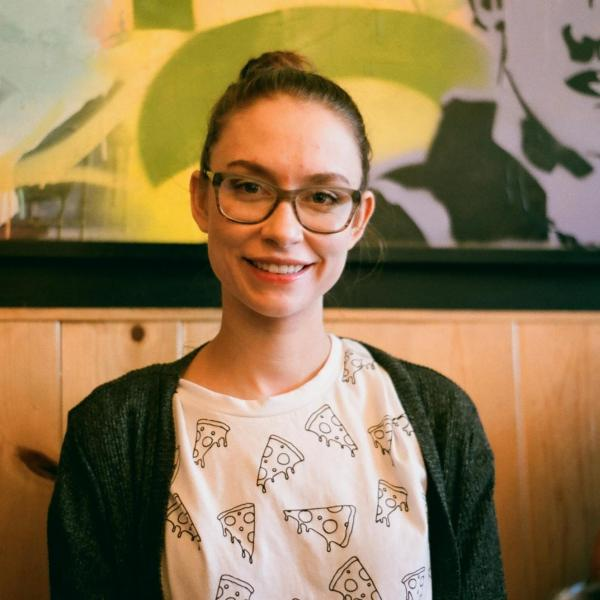
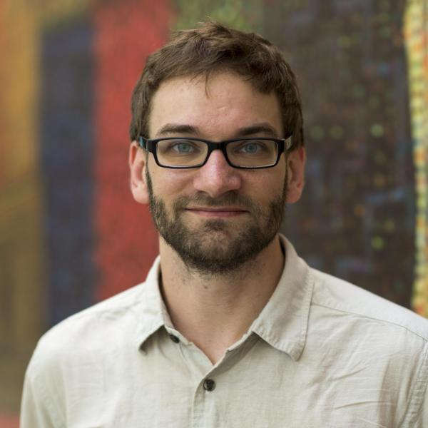

# WHC2021SIC Project Template

<!-- Replace Project Template by your team name in title and description -->

Project Template for the IEEE World Haptics Conference 2021 Student Innovation Challenge

https://2021.worldhaptics.org/sic/

## Authors

### Team

<!-- For each team member, duplicate this following subsection and update Name, biography, pronouns and website. Please store pictures under images/portraits/ and use only Name in CamelCase for filenames. -->

#### Sandra Bae

Sandra Bae is a data visualization researcher gone rogue. She dream of a future with as much of Materials Science as Computer Science. Her current research interest focuses on pushing data beyond the flat screen by exploring how materials can communicate and represent data. She likes to work on projects as a developer and designer with a focus on information visualization and has worked with NASA-JPL, the John Muir Institute, and the Exploratorium Museum. She is interested in how interactive visualizations can help break down complex topics and promote creativity, storytelling, and insight. Broadly speaking, she is interested in projects that promote the interplay of human, machine, and data. Sandra is co-advised by Danielle Szafir and Ellen Do, and she is a member of both the VisuaLab and ACME Lab. She holds a BA in human-computer interactions and an MS in computer science, both from the University of California, Davis.

Find more information on her [website](https://sandrabae.github.io).

#### Chris Hill

Chris Hill is a Ph.D. student in Creative Technology and Design advised by Ann Eisenberg and Daniel Leithinger. He is a McNair Scholar, a Google CS Research Mentorship participant, and he received honorable mention in the 2020 Computing Research Association Outstanding Undergraduate Researcher awards. His research interests lie in human augmentation, sensory extension, transhumanism, biohacking, and educational technology. These interests have led to the development of open-source sensory extension and augmentation devices that he hopes will be replicated, accelerating scientific discovery and building stronger development communities in the field.

Find more information on his <!-- update pronouns--> [website](https://chrisnhill.com/).

#### Casey Hunt

Casey Hunt is an ACS Certified Biochemist with a Bachelor’s degree from the University of Utah. After several years of work in environmental and personnel monitoring for the immuno-oncology startup NextCure, Casey became fascinated by the myriad of sensors in the lab designed to track personnel (and microbe) activity—as well as the psychosocial factors at play in this ubiquitous sensing environment. For the last two years, she has designed novel sensing techniques for ubiquitous computing applications as a Master’s student in Creative Technology and Design and a member of the THING Lab at the CU ATLAS Institute. Casey is especially motivated by the need for haptic systems to facilitate remote collaboration and connection.

Find more information on her <!-- update pronouns--> [website](https://caseyhunt.github.io/).

#### Netta Ofer

Netta Ofer is a Research Master's student in the Living Matter Lab at the ATLAS Institute. Her background is in media studies, human-computer interaction (HCI), and interaction design from the Media Innovation Lab (milab) at IDC Herzliya. Netta's work has focused on how coding can create creative and personally-meaningful opportunities for children, specifically by bridging the digital and physical worlds. Today, her design research aims to discuss the relationship between the designed and natural world, and the human body from a speculative and critical lens.

<!-- Find more information on their [website](https://). -->

#### Mary West

Mary Etta West completed her Bachelor of Science in Electrical Engineering from the University of Nevada Las Vegas in 2015. She went on to spend five years in the industry inventing and designing products and tools for SparkFun Electronics and Boulder Engineering Studio. She is currently in her second year as a Ph.D. student in Computer Science at the University of Colorado Boulder focusing on wearables, human-computer interaction and integration, physical computing, robotics, and data physicalization. She is advised by Danielle Szafir, Ben Shapiro, and Joel Swanson.

Find more information on her <!-- update pronouns--> [website](https://).

### Advisor

<!-- Uncomment this section title and add a #### Name subsection if your team appointed an advisor. -->
#### Daniel Leithinger

Daniel Leithinger, assistant professor (ATLAS Institute & Computer Science) creates shape-changing human-computer interfaces that push digital information past the boundaries of flat displays, and into the real world. Motivated by the belief that computers must embrace the dexterity and expressiveness of the human body, his interfaces allow users to touch, grasp and deform data physically. Daniel received his Ph.D. at the MIT Media Lab in 2015. His academic publications have been published at ACM UIST, TEI, and CHI conferences, and he has received design awards from Fast Company, Red Dot, and IDEA. Projects like "inFORM" have been exhibited at the Cooper Hewitt Design Museum, Ars Electronica Museum, and the Milan Design Week.

Find more information on his <!-- update pronouns--> [website](http://leithinger.com/).

### Chairs

#### Christian Frisson

Christian Frisson is an associate researcher at the Input Devices and Music Interaction Laboratory (IDMIL) (2021), previously postdoctoral researcher at McGill University with the IDMIL (2019-2020), at the University of Calgary with the Interactions Lab (2017-2018) and at Inria in France with the Mjolnir team (2016-2017). He obtained his PhD at the University of Mons, numediart Institute, in Belgium (2015); his MSc in “Art, Science, Technology” from Institut National Polytechnique de Grenoble with the Association for the Creation and Research on Expression Tools (ACROE), in France (2006); his Masters in Electrical (Metrology) and Mechanical (Acoustics) Engineering from ENSIM in Le Mans, France (2005).
Christian Frisson is a researcher in Human-Computer Interaction, with expertise in Information Visualization, Multimedia Information Retrieval, and Tangible/Haptic Interaction. Christian creates and evaluates user interfaces for manipulating multimedia data. Christian favors obtaining replicable, reusable and sustainable results through open-source software, open hardware and open datasets.
With his co-authors, Christian obtained the IEEE VIS 2019 Infovis Best Paper award and was selected among 4 finalists for IEEE Haptics Symposium 2020 Most Promising WIP.

Find more information on his [website](https://frisson.re).

#### Jun Nishida

Jun Nishida is **Currently** Postdoctoral Fellow at University of Chicago & Research Fellow at Japan Society for the Promotion of Science (JSPS PDRA) / **Previously** JSPS Research Fellow (DC1), Project Researcher at Japanese Ministry of Internal Affairs and Communications, SCOPE Innovation Program & PhD Fellow at Microsoft Research Asia / Graduated from Empowerment Informatics Program, University of Tsukuba, Japan.

I’m a postdoctoral fellow at University of Chicago. I have received my PhD in Human Informatics at University of Tsukuba, Japan in 2019. I am interested in designing experiences in which all people can maximize and share their physical and cognitive capabilities to support each other. I explore the possibility of this interaction in the field of rehabilitation, education, and design. To this end, I design wearable cybernic interfaces which share one’s embodied and social perspectives among people by means of electrical muscle stimulation, exoskeletons, virtual/augmented reality systems. Received more than 40 awards including Microsoft Research Asia Fellowship Award, national grants, and three University Presidential Awards. Review service at ACM SIGCHI, SIGGRAPH, UIST, TEI, IEEE VR, HRI.

Find more information on their [website](https://junis.sakura.ne.jp/wp).

#### Heather Culbertson

Heather Culbertson is a Gabilan Assistant Professor of Computer Science at the University of Southern California. Her research focuses on the design and control of haptic devices and rendering systems, human-robot interaction, and virtual reality. Particularly she is interested in creating haptic interactions that are natural and realistically mimic the touch sensations experienced during interactions with the physical world. Previously, she was a research scientist in the Department of Mechanical Engineering at Stanford University where she worked in the Collaborative Haptics and Robotics in Medicine (CHARM) Lab. She received her PhD in the Department of Mechanical Engineering and Applied Mechanics (MEAM) at the University of Pennsylvania in 2015 working in the Haptics Group, part of the General Robotics, Automation, Sensing and Perception (GRASP) Laboratory. She completed a Masters in MEAM at the University of Pennsylvania in 2013, and earned a BS degree in mechanical engineering at the University of Nevada, Reno in 2010. She is currently serving as the Vice-Chair for Information Dissemination for the IEEE Technical Committee on Haptics. Her awards include a citation for meritorious service as a reviewer for the IEEE Transactions on Haptics, Best Paper at UIST 2017, and the Best Hands-On Demonstration Award at IEEE World Haptics 2013.

Find more information on her [website](https://sites.usc.edu/culbertson/).

## Contents

Generated with `npm run toc`, see [INSTALL.md](INSTALL.md).

Once this documentation becomes very comprehensive, the main file can be split in multiple files and reference these files.

<!-- Table of contents generated by running from repository root: npm run toc -->

<!-- toc -->

- [Abstract](#abstract)
- [Introduction](#introduction)
- [Motivation](#motivation)
  * [Documentation](#documentation)
    + [Hardware](#hardware)
      - [Sensors wiring](#sensors-wiring)
    + [Software](#software)
- [Acknowledgements](#acknowledgements)
- [License](#license)

<!-- tocstop -->

## Abstract

<!-- Summarize your project: for now copy the short pitch from your proposal -->

Cyborg Crafts: Vibrotactile Tongue Vision (VTTV) is a seven-segment vibrotactile tongue display that enables users to augment auditory and visual experiences through haptics.

## Introduction

<!-- Explain your project: for now copy the 300-word description from your proposal -->

The Vibrotactile Tongue Vision (VTTV) system is an open-source programmable tongue display unit (TDU) that augments visual and auditory experiences through haptic feedback. VTTV is designed to be low floor and wide walls [1], enabling those without embedded systems skills to fabricate a TDU, controller, and craft tactile experiences easily. Experienced engineers, researchers, makers, and artists can hack VTTV to be an actuator in their projects. Cyborg Crafts will design, fabricate, and implement a TDU that will extend the user’s perception through a vibrotactile display. The project will also produce a controller to program haptic patterns directly to the VTTV system. TDUs typically use electrotactile stimulation to display information to the user. These systems produce sensations by generating voltage pulses from electrodes to the user’s tongue. These commercial TDU systems are closed source, prohibitively expensive, and compromise haptic resolution for user comfort. Cyborg Crafts proposes an alternative to electrotactile TDUs, a novel system that uses ERM motors for actuation. Cyborg Craft’s goal is to enable anyone to fabricate their own TDU using easily accessible materials with affordable tools. The merit of this project will be to produce a replicable design with instructions on free-to-use online platforms such as Instructables. This will enable makers, students, artists, hackers, and researchers to fabricate and implement a TDU that will interface with projects as an output device. Through the Student Innovation Challenge, we will be able to present a new type of tongue display that uses vibrotactile outputs to the IEEE research community.

## Motivation
VTTV is motivated by our interest in enabling users to craft tactile sensory experiences. Crafting tactile experiences has the potential to engage a wide range of users through an accessible interface and hackable TDU actuator. The tongue is an extremely sensitive and uniquely discrete area for open-source haptic output that has not been fully explored [3].

### Documentation

#### Hardware

The VTTV will use seven ERM coin cell vibration motors (Figure 1). The TDU will be interfaced with a controller and be encased in an easily sourceable, mouth-safe, substrate. The controller (Figure 2) will programmatically control seven individual haptic motors using a Raspberry Pi 4, syntacts board, Texas Instruments’ DRV2605L haptic motor drivers, an LCD screen, and potentiometers.

Figure 1

Figure 2

##### Sensors wiring

<!-- Feel free to remove or adapt the following explanation once you have understood its potential implications for your project. -->

We use the SparkFun Qwiic system to rapidly and remotely prototype sensors without much soldering. Qwiic uses the I2C communication protocol with addresses assigned per board model.
Our Qwiic-based architectures may require:
- 1 Qwiic MUX I2C multiplexer board per group identical sensor/board model (example: needed by 2 flex finger boards in the figures below)
- 1 Qwiic ADC board per group of 4 sensors that are not implemented as Qwiic boards (example: needed by 4 FSRs sensors in the figures below)

<!-- Adapt this sensor architecture, covering all possible sensors accross all teams, to your team. -->

Made with [drawio-desktop](https://github.com/jgraph/drawio-desktop/) (online version: [diagrams.net](https://www.diagrams.net/)).

<!-- see: https://www.diagrams.net/blog/embed-diagrams-github-markdown -->

#### Software

<!-- Describe your software components -->

## Acknowledgements

<!-- Describe your software components -->

SIC chairs would like to thank Evan Pezent, Zane A. Zook and Marcia O'Malley from [MAHI Lab](http://mahilab.rice.edu) at Rice University for having distributed to them 2 [Syntacts](https://www.syntacts.org) kits for the [IROS 2020 Intro to Haptics for XR Tutorial](http://iros-haptics-tutorial.org/).
SIC co-chair Christian Frisson would like to thank Edu Meneses and Johnty Wang from [IDMIL](http://idmil.org) at McGill University for their recommendations on Raspberry Pi hats for audio and sensors.

## References
1. Resnick, M., Myers, B., Nakakoji, K., Shneiderman, B., Pausch, R., Selker, T., & Eisenberg, M. 2005. Design principles for tools to support creative thinking. In NSF Workshop Report on Creativity Support Tools. 25–35.
2. https://dictionary.cambridge.org/us/dictionary/english/crafting
3. Lozano, C. A., Kaczmarek, K. A., & Santello, M. (2009). Electrotactile stimulation on the tongue: Intensity perception, discrimination, and cross-modality estimation. Somatosensory & motor research, 26(2), 50–63. https://doi.org/10.1080/08990220903158797
Kaye, J. J. (2004). Making Scents: aromatic output for HCI. interactions, 11(1), 48-61.

## License

This documentation is released under the terms of the Creative Commons Attribution Share Alike 4.0 International license (see [LICENSE.txt](LICENSE.txt)).
